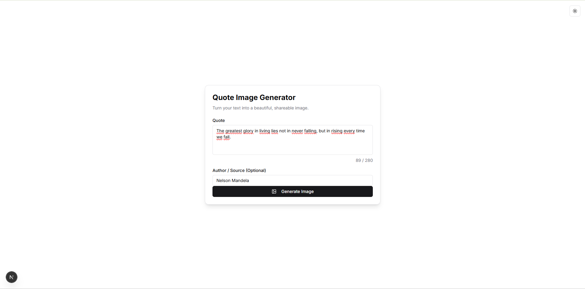

# Quote Image Generator

A Next.js app to generate beautiful, shareable images from text quotes. Built with Server Actions, @vercel/og, and shadcn/ui.



## ✨ Features

- **Dynamic Image Generation:** Converts text into a high-quality PNG image on the fly.
- **Instant Preview:** See what your image looks like before you download it.
- **Customizable Input:** Add both a main quote and an optional author/source.
- **Downloadable:** Get a 1200x630 (social media-friendly) image to share anywhere.
- **Server-Side Logic:** Uses Next.js Server Actions to handle form submission and image generation securely.

## 🛠️ Tech Stack

- **Framework:** [Next.js](https://nextjs.org/) (App Router)
- **Styling:** [Tailwind CSS](https://tailwindcss.com/)
- **Components:** [shadcn/ui](https://ui.shadcn.com/)
- **Image Generation:** [@vercel/og](https://vercel.com/docs/functions/edge-functions/og-image-generation)
- **Form Handling:** [React Server Actions](https://nextjs.org/docs/app/building-your-application/data-fetching/server-actions-and-mutations)
- **Database:** [MongoDB](https://www.mongodb.com/) & [Prisma](https://www.prisma.io/) (for logging generated images)
- **Language:** [TypeScript](https://www.typescriptlang.org/)
- **Deployment:** [Vercel](https://vercel.com/)

## 🚀 Getting Started

Follow these instructions to get a copy of the project up and running on your local machine for development and testing.

### Prerequisites

- [Node.js](https://nodejs.org/en) (v18 or later)
- [npm](https://www.npmjs.com/) (or `yarn` / `pnpm`)
- A [MongoDB Atlas](https://www.mongodb.com/cloud/atlas) account (a free cluster is sufficient)

### Installation

1.  **Clone the repository:**

    ```bash
    git clone [https://github.com/Malike01/quote-image-generator](https://github.com/Malike01/quote-image-generator)
    cd quote-image-generator
    ```

2.  **Install dependencies:**

    ```bash
    npm install
    ```

3.  **Sync the database schema:**
    This will sync your Prisma schema with your MongoDB database.

    ```bash
    npx prisma db push
    ```

4.  **Run the development server:**
    ```bash
    npm run dev
    ```

Open [http://localhost:3000](http://localhost:3000) with your browser to see the application.

## 📄 License

This project is licensed under the MIT License. See the `LICENSE` file for details.
